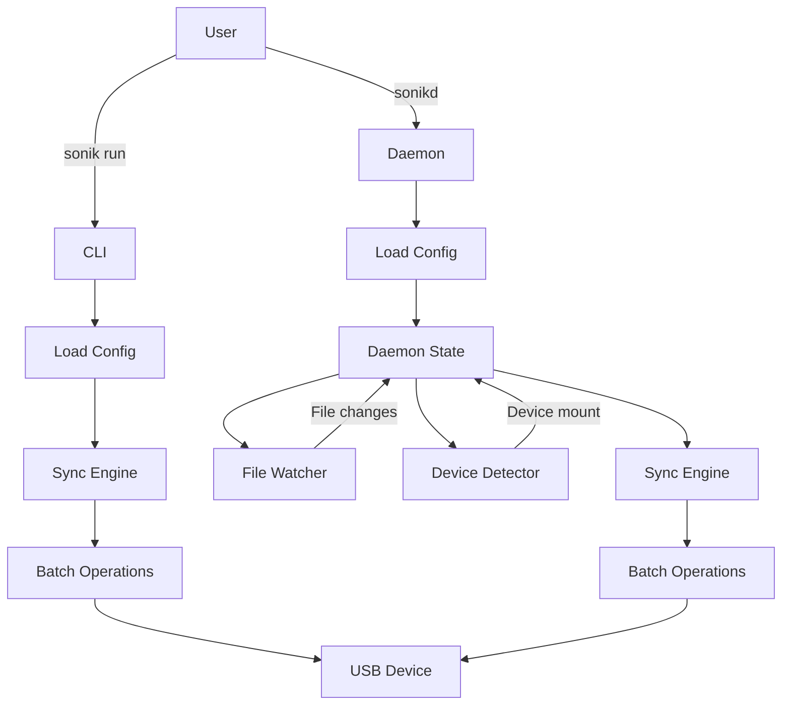
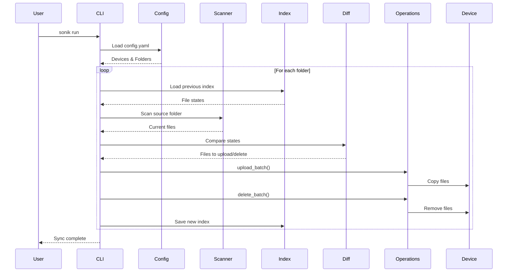
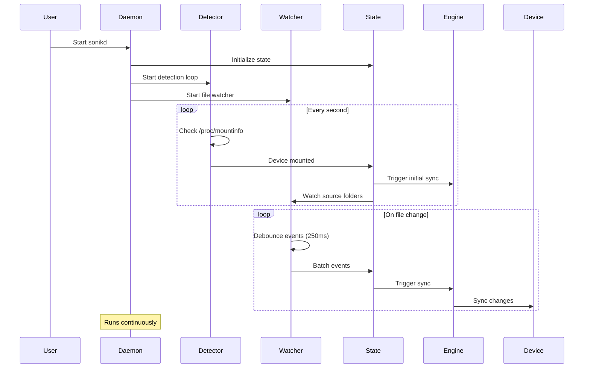
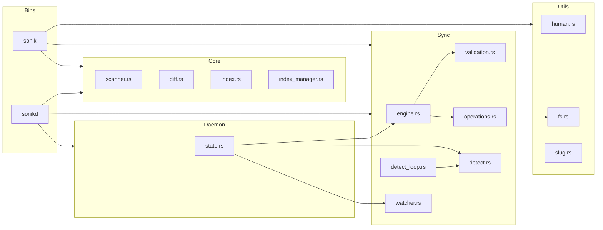
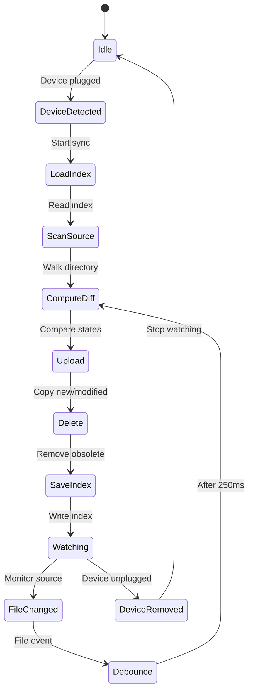
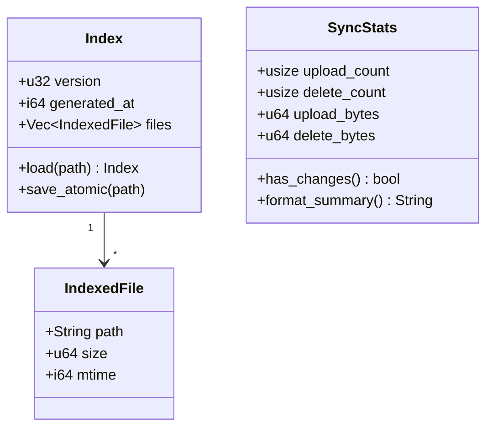
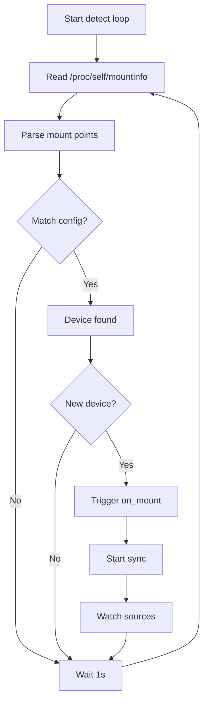

# Architecture

## Overview

```mermaid
graph TB
    User[User] -->|sonik run| CLI[CLI]
    User -->|sonikd| Daemon[Daemon]
    
    CLI --> Config[Load Config]
    Config --> SyncEngine[Sync Engine]
    SyncEngine --> Operations[Batch Operations]
    Operations --> Device[USB Device]
    
    Daemon --> Config2[Load Config]
    Config2 --> DaemonState[Daemon State]
    DaemonState --> Watcher[File Watcher]
    DaemonState --> Detector[Device Detector]
    
    Watcher -->|File changes| DaemonState
    Detector -->|Device mount| DaemonState
    DaemonState --> SyncEngine2[Sync Engine]
    SyncEngine2 --> Operations2[Batch Operations]
    Operations2 --> Device
```

## CLI Flow (sonik run)

```mermaid
sequenceDiagram
    participant User
    participant CLI
    participant Config
    participant Scanner
    participant Index
    participant Diff
    participant Operations
    participant Device

    User->>CLI: sonik run
    CLI->>Config: Load config.yaml
    Config-->>CLI: Devices & Folders
    
    loop For each folder
        CLI->>Index: Load previous index
        Index-->>CLI: File states
        
        CLI->>Scanner: Scan source folder
        Scanner-->>CLI: Current files
        
        CLI->>Diff: Compare states
        Diff-->>CLI: Files to upload/delete
        
        CLI->>Operations: upload_batch()
        Operations->>Device: Copy files
        
        CLI->>Operations: delete_batch()
        Operations->>Device: Remove files
        
        CLI->>Index: Save new index
    end
    
    CLI-->>User: Sync complete
```

## Daemon Flow (sonikd)

```mermaid
sequenceDiagram
    participant User
    participant Daemon
    participant Detector
    participant Watcher
    participant State
    participant Engine
    participant Device

    User->>Daemon: Start sonikd
    Daemon->>State: Initialize state
    Daemon->>Detector: Start detection loop
    Daemon->>Watcher: Start file watcher
    
    loop Every second
        Detector->>Detector: Check /proc/mountinfo
        Detector->>State: Device mounted
        State->>Engine: Trigger initial sync
        State->>Watcher: Watch source folders
    end
    
    loop On file change
        Watcher->>Watcher: Debounce events (250ms)
        Watcher->>State: Batch events
        State->>Engine: Trigger sync
        Engine->>Device: Sync changes
    end
    
    Note over Daemon: Runs continuously
```

## Module Architecture

```mermaid
graph LR
    subgraph Core
        Scanner[scanner.rs]
        Diff[diff.rs]
        Index[index.rs]
        IndexMgr[index_manager.rs]
    end
    
    subgraph Sync
        Engine[engine.rs]
        Operations[operations.rs]
        Validation[validation.rs]
        Watcher[watcher.rs]
        Detect[detect.rs]
        DetectLoop[detect_loop.rs]
    end
    
    subgraph Utils
        Human[human.rs]
        FS[fs.rs]
        Slug[slug.rs]
    end
    
    subgraph Daemon
        State[state.rs]
    end
    
    subgraph Bins
        CLI[sonik]
        Daem[sonikd]
    end
    
    CLI --> Core
    CLI --> Sync
    CLI --> Utils
    
    Daem --> Daemon
    Daem --> Sync
    Daem --> Core
    
    Engine --> Operations
    Engine --> Validation
    Operations --> FS
    
    State --> Watcher
    State --> Detect
    State --> Engine
    
    DetectLoop --> Detect
```

## Sync Cycle

```mermaid
stateDiagram-v2
    [*] --> Idle
    Idle --> DeviceDetected: Device plugged
    DeviceDetected --> LoadIndex: Start sync
    LoadIndex --> ScanSource: Read index
    ScanSource --> ComputeDiff: Walk directory
    ComputeDiff --> Upload: Compare states
    Upload --> Delete: Copy new/modified
    Delete --> SaveIndex: Remove obsolete
    SaveIndex --> Watching: Write index
    Watching --> FileChanged: Monitor source
    FileChanged --> Debounce: File event
    Debounce --> ComputeDiff: After 250ms
    Watching --> DeviceRemoved: Device unplugged
    DeviceRemoved --> Idle: Stop watching
```

## Index Structure

```mermaid
classDiagram
    class Index {
        +u32 version
        +i64 generated_at
        +Vec~IndexedFile~ files
        +load(path) Index
        +save_atomic(path)
    }
    
    class IndexedFile {
        +String path
        +u64 size
        +i64 mtime
    }
    
    class SyncStats {
        +usize upload_count
        +usize delete_count
        +u64 upload_bytes
        +u64 delete_bytes
        +has_changes() bool
        +format_summary() String
    }
    
    Index "1" --> "*" IndexedFile
```

## Device Detection

```mermaid
flowchart TD
    Start[Start detect loop] --> Read[Read /proc/self/mountinfo]
    Read --> Parse[Parse mount points]
    Parse --> Check{Match config?}
    Check -->|Yes| Found[Device found]
    Check -->|No| Wait[Wait 1s]
    Found --> Compare{New device?}
    Compare -->|Yes| Mount[Trigger on_mount]
    Compare -->|No| Wait
    Wait --> Read
    Mount --> Sync[Start sync]
    Sync --> Watch[Watch sources]
    Watch --> Wait
```
