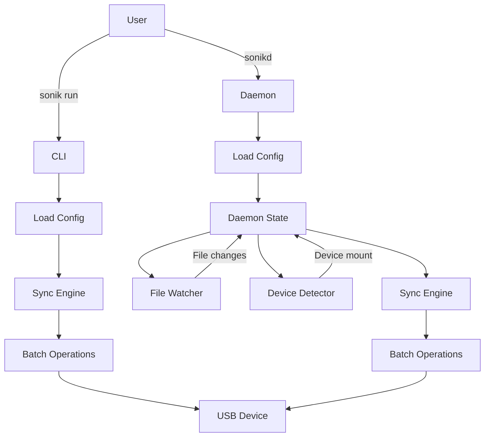

# Sonik


[](https://github.com/royaurelien/sonik/actions/workflows/release.yml)

Originally built for the Innoasis Y1 MP3 player, Sonik focuses on **syncing folders**, not managing a music library (see [beets](https://github.com/beetbox/beets) for that).
 
It performs **diff-based transfers** with **no unnecessary writes**, preserving the lifespan of your device.
 
**Fast**, **minimal**, and **adaptable**, It can easily extend to other targets beyond music players.

## Features

- Incremental sync (only changed files)
- Automatic device detection via hot-plug monitoring
- Real-time file watching with debouncing
- Binary index for fast comparison
- Multi-device support with YAML configuration
- Progress bars and detailed statistics

## Installation

See the [releases page](https://github.com/royaurelien/sonik/releases) for pre-built binaries.

This provides two binaries: `sonik` (CLI) and `sonikd` (daemon).

## Configuration

Use `sonik edit-config` to define your devices and folders (configuration file is generally located at `~/.config/sonik/config.yaml`).

To add a device, use the following template:

```yaml
device:
  - name: MY_DEVICE
    label: "My Device"
    mount: "/media/{user}/{device}"
    mountinfo: true
    folders:
      - source: "~/Music/Library"
        target: "Music"
        enabled: true
```


| Field      | Description |
|------------|-------------|
| **name**       | Unique device identifier, must match actual mount point. |
| **label**      | Device label (friendly name, not required). |
| **mount**      | Expected mount path template. The mount path is where the device is expected to be found. It depends on your desktop environment: `/media/{user}/` for Ubuntu/GNOME, `/run/media/{user}/` for KDE/Fedora/Arch. |
| **mountinfo**  | Enable automatic detection via /proc/self/mountinfo (**recommended**). Otherwise, detection is performed by checking the existence of the full path to the mount point. |
| **source**     | Local source folder path. Relative paths are expanded from the user's home directory. |
| **target**     | Target folder on device (relative to mount point). |
| **enabled**    | Enable/disable this folder sync. |


The following placeholders are supported in paths:
- `{user}` is replaced with your username.
- `{uid}` is replaced with your user ID.
- `{device}` is replaced with the device name.

> Multiple devices and folders can be defined in the configuration file.

## Usage

Manual sync: `sonik run`  
Daemon mode: `sonikd`

## How It Works

Sonik uses binary index files stored locally to track file states (path, size, mtime). On sync, it compares the current filesystem state with the index to determine what needs to be uploaded or deleted.

The daemon monitors for device mounts and watches source directories with inotify. Events are debounced to avoid excessive syncs during rapid file changes.



## Requirements

Linux with inotify support, Rust 1.70+. Target devices must be real filesystems (no MTP).

## Systemd Service

To run sonikd automatically, install the provided systemd user service:

```bash
mkdir -p ~/.config/systemd/user
cp sonik.service ~/.config/systemd/user/sonikd.service
systemctl --user enable --now sonikd.service
```

View logs with `journalctl --user -u sonikd -f`

## Development

Standard Rust workflow: `cargo build`, `cargo test`, `cargo clippy`.

The codebase is organized into core (scanning, diff, index), sync (engine, watcher, operations), utils (formatting, filesystem), and daemon (state management) modules.

## Troubleshooting

Check device detection: `ls /media/$USER/`  
Test write permissions: `touch /media/$USER/MyUSB/.test`  
Check daemon status: `ps aux | grep sonikd`  
Enable debug logs: `RUST_LOG=debug sonik run`

## Troubleshooting

**Device not detected**: Check that device name in config matches mount point:
```bash
ls /media/$USER/
```

**Permission denied**: Ensure target device is writable:
```bash
touch /media/$USER/MyUSB/.test && rm /media/$USER/MyUSB/.test
```

**Sync not triggering**: Check daemon is running:
```bash
ps aux | grep sonikd
```

**Logs not showing**: Enable debug logging:
```bash
RUST_LOG=debug sonik run
```


## License

MIT
