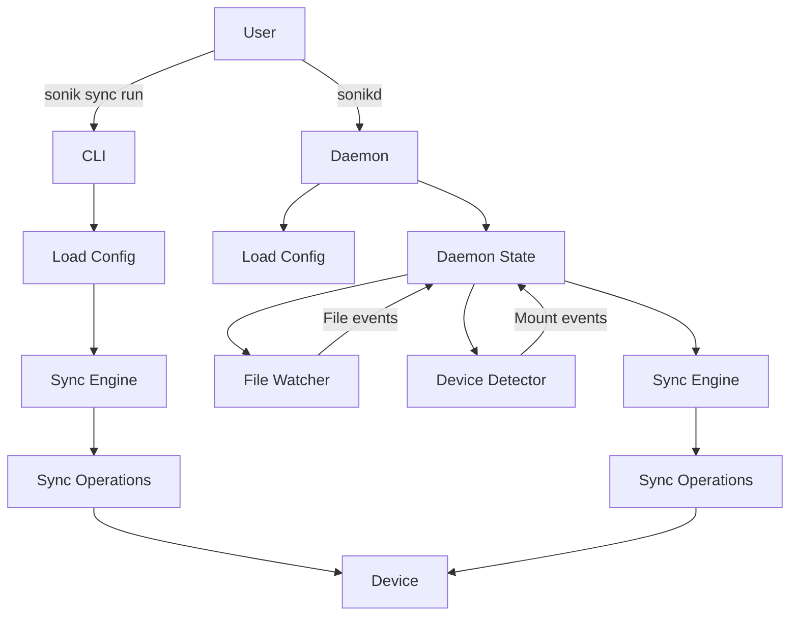

# Sonik

<div style="color:#0F52BA; text-align:center; font-size:1.4em; font-weight:600; letter-spacing:0.5px;">
  Fast diff-based sync for devices
</div>


[](https://github.com/royaurelien/sonik/actions/workflows/release.yml)

Originally built for the Innoasis Y1 MP3 player, Sonik focuses on **syncing folders**, not managing a music library (see [beets](https://github.com/beetbox/beets) for that).

It performs **diff-based transfers** with **no unnecessary writes**, preserving your device’s lifespan.

**Fast**, **minimal**, and **adaptable**, it can easily extend to other targets beyond music players.

## Features

- Incremental sync (only changed files)
- Real-time device detection via mount monitoring
- Live file watching with debouncing
- Binary index for fast comparison
- Multi-device support with a simple YAML config
- Progress bars and detailed statistics

## Installation

Download pre-built binaries from the **[Releases page](https://github.com/royaurelien/sonik/releases)**

You will get:

- `sonik` — CLI tool  
- `sonikd` — background daemon  

## Configuration

Run:

```bash
sonik config edit
```

The config file is typically located at:

```
~/.config/sonik/config.yaml
```

Example:

```yaml
device:
  - name: MY_DEVICE
    label: "My Device"
    mount: "/media/{user}/{device}"
    mountinfo: true
    folders:
      - source: "~/Music/Library"
        target: "Music"
        enabled: true
```

### Fields

| Field        | Description |
|--------------|-------------|
| **name**     | Unique identifier. Must match the final directory name in the mount path. |
| **label**    | Optional friendly name. |
| **mount**    | Mount path template. Usually `/media/{user}/` (Ubuntu/GNOME) or `/run/media/{user}/` (KDE/Fedora/Arch). |
| **mountinfo**| Use `/proc/self/mountinfo` for detection (**recommended**). |
| **source**   | Local folder. `~` and relative paths are expanded from user home. |
| **target**   | Folder on device (relative to mount). |
| **enabled**  | Enable/disable sync for this folder. |

### Supported placeholders

- `{user}`: username  
- `{uid}`: user ID  
- `{device}`: device directory name  

You may define **multiple devices and folders**.

> If in doubt, use the `sonik config show` command to check the interpreted values.

## Usage

Manual sync:

```bash
sonik sync run
```

Daemon:

```bash
sonikd
```

### Run in background (systemd user)

If you installed manually:

```bash
mkdir -p ~/.config/systemd/user
cp sonik.service ~/.config/systemd/user/sonik.service
systemctl --user daemon-reload
systemctl --user enable --now sonik.service
```

View logs:

```bash
journalctl --user -u sonik -f
```

## How It Works

Sonik keeps a local binary index for each device/folder pairing.  
During sync, it compares:

- current filesystem state  
- previous index  

…to determine exactly what to upload or delete — avoiding unnecessary writes.

The daemon (`sonikd`) handles:

- device mount detection  
- directory watching (via inotify)  
- debounced event processing  



## Requirements

- Linux with **inotify** (most modern distros include this by default)
- Target devices must expose a regular file system (**no MTP**)  

## Development

Rust 1.70+

```bash
cargo build
cargo test
cargo clippy
```

## Troubleshooting

**Device not detected**  
Check real mount directory:

```bash
ls -l /media/$USER/
```

**Permission denied**  
Verify write permissions:

```bash
touch /media/$USER/MyUSB/.test && rm /media/$USER/MyUSB/.test
```

**Daemon not syncing**  
Check process:

```bash
ps aux | grep sonikd
```

**Want verbose logs?**

```bash
RUST_LOG=debug sonik sync run
```

## License

MIT
